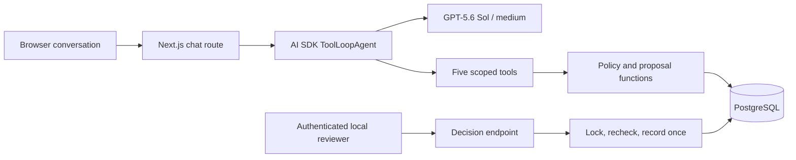

# A small domain harness

The domain is damaged-order replacements for a fictional homewares store. The model reasons about requests, while application code owns authority and business records.

## Authority

The agent has no shell, arbitrary SQL, network browsing, approval tool, or operator secret. Its functions close over the server-owned case and browser owner identifiers. These values are not accepted as model tool arguments.

Reviewer authentication compares a generated local secret and sets an HttpOnly, SameSite cookie signed for that browser session. The decision route checks this credential and ownership before loading the saved proposal. CSRF checks compare Origin to the incoming Host. This is a local teaching credential, not a complete production identity system.

Client conversation history is untrusted. The chat route accepts only the latest bounded user text, discards supplied history, and reloads stored messages. An assistant message or approval flag sent by the client cannot create an approval.

## Persistence and execution

PostgreSQL stores cases, conversations, proposals, receipts, and events. Every scenario has its own fictional order and stock, so examples do not interfere with one another. This deliberately does not model a shared merchant inventory system.

One immutable proposal and one receipt are allowed per case. Approval locks the case and proposal, checks policy version, quantity, dates and current stock, then updates inventory, status and receipt in one transaction. A unique proposal receipt constraint and transaction checks make repeated approval return the existing result. A rejected proposal cannot later be approved.

Chat requests acquire a two-minute lease and have a 90-second model timeout. A lease token fences proposal writes from an expired invocation and prevents an old invocation from overwriting newer history. Duplicate user-message IDs are rejected. A crashed process can leave a busy case until the lease expires. The application does not claim durable, exactly-once LLM execution.

The server drains streaming responses so browser disconnects do not ordinarily skip persistence. Hard process termination can still lose the unfinished assistant message. Durable proposals and receipts are independently queryable after recovery.

The agent loop allows eight steps, at most one SDK retry per model request, and up to 2,500 output tokens per step. These are bounded execution settings, not a hard dollar budget. Conversation and input sizes are limited. Reasoning summaries are disabled, and reasoning text is not rendered.

## What makes this a harness

`src/lib/agent.ts` holds the deliberate instructions, tool surface and loop controls. `src/app/api/chat/route.ts` supplies trusted history and owns streaming/persistence. `src/lib/store.ts` implements business invariants. The UI makes tool activity and recorded results inspectable.

AI Elements supplies conversation, message and tool presentation. The approval card is application UI backed by the decision endpoint, not a model-owned approval response. Vercel's AI SDK is a library dependency; this project uses neither Eve nor Vercel hosting nor an AI Gateway. The verified model path uses Bedrock's OpenAI-compatible Responses endpoint; direct OpenAI is also configurable.

## Limits

No real shipment, payment, customer system or external fulfillment API is connected. Database duplicate protection does not establish exactly-once external fulfillment. A compatible PostgreSQL host could replace the local database, but no cloud provider is required or recommended here. External hosting would also require proper identity, operational limits, secret handling and deployment-specific configuration.
