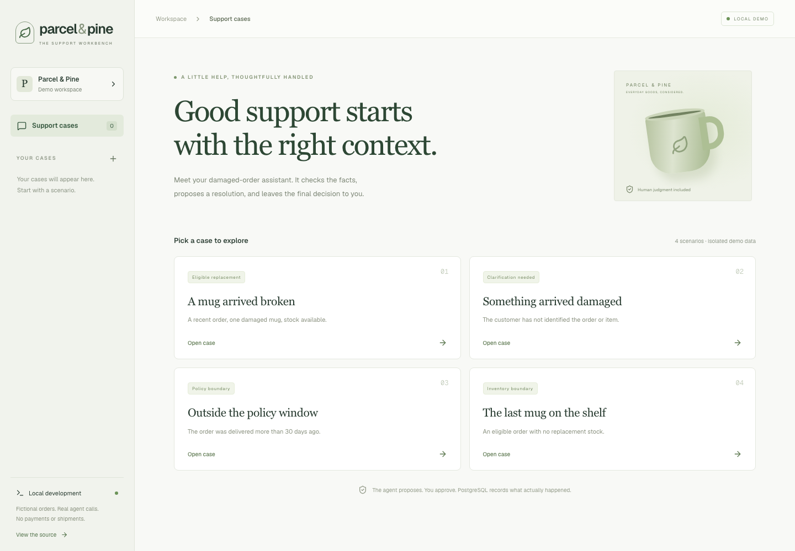
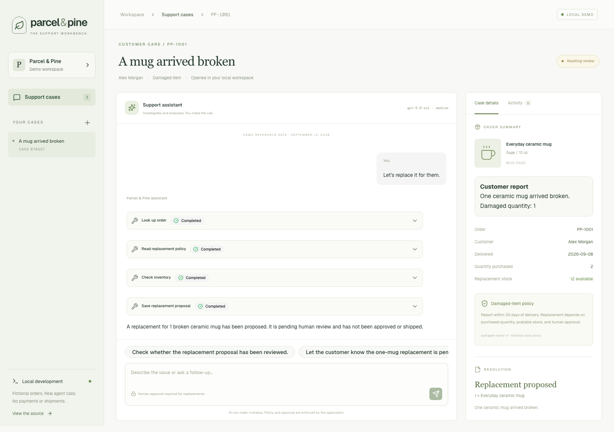
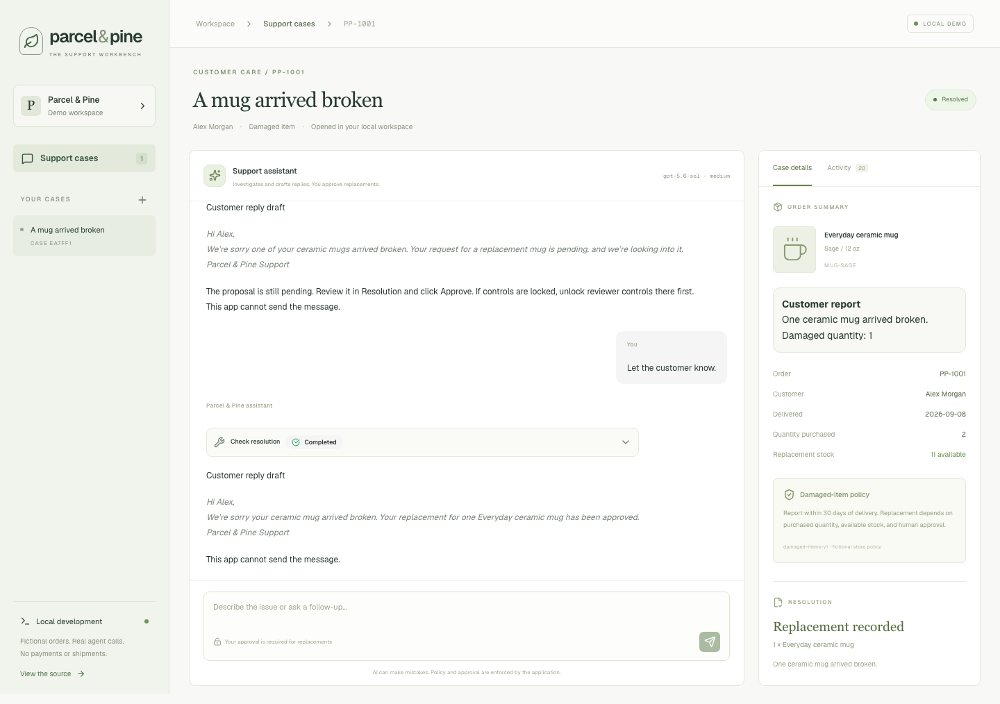

# Building Custom Agent Harnesses for Specific Domains Using Vercel's AI SDK

## What is an agent harness?

An agent harness is the software around an AI model that lets it work on a task. It supplies context and tools, executes the model's tool requests, feeds back the results, and controls when the agent continues or stops.

For example, the model requests an order lookup. The harness returns the order, giving the model the information it needs to check inventory or ask a follow-up question.

HumanLayer describes a coding agent's harness as “the agent’s runtime” in Kyle's [*Skill Issue: Harness Engineering for Coding Agents*](https://www.humanlayer.dev/blog/skill-issue-harness-engineering-for-coding-agents). [Cloudflare's documentation](https://developers.cloudflare.com/agents/harnesses/) describes the work around each model turn, including prompt construction, tool handling, message persistence, and stopping decisions.

| Agent | Context it needs | Tools it can use | Application controls |
| --- | --- | --- | --- |
| Coding assistant | Repository files, instructions, previous work | Read files, edit code, run tests | File access, command permissions, execution limits |
| Damaged-order support assistant | Selected order, damage report, policy, saved decisions | Look up an order, check stock, propose a replacement | Case ownership, replacement eligibility, approval |

We'll build the support example with Next.js, Vercel's AI SDK, AI Elements, and PostgreSQL, then compare Sol and Luna on the same conversations. The walkthrough assumes familiarity with TypeScript and web applications.

An **agent harness** runs the agent. An **eval harness** runs test conversations against it and checks the results. The [example repository](https://github.com/mattlgroff/custom-agent-harness) includes both.

## The job: replace one broken mug

**Parcel & Pine** is a fictional homewares store. A support employee opens a case for Alex Morgan, whose order contained two mugs. One arrived broken.

The employee types:

> Let's replace it for them.

The assistant should use the open case to check the order, policy, and stock, then save a proposal for one replacement. The employee reviews that proposal and clicks **Approve**. Afterward, “Let the customer know” should produce a customer reply draft based on the recorded decision.



*The local workbench uses fictional orders. Each case has independent stock and conversation history.*

The store policy requires a damage report within 30 days of delivery, enough stock, and a replacement quantity within the purchased quantity. The scenarios use a fixed reference date so an eligible example does not expire between publication and the day someone runs it.

Approval creates a simulated replacement record and decrements local stock. The POC does not contact customers or ship anything.

## Where the AI SDK fits

The AI SDK’s [`ToolLoopAgent`](https://ai-sdk.dev/docs/agents/overview) handles the loop between model calls and tool results. Our code decides what context enters that loop, which tools exist, and what those tools may change.

The SDK also has a [`HarnessAgent`](https://ai-sdk.dev/docs/ai-sdk-harnesses/overview) integration for established runtimes such as Pi. I used `ToolLoopAgent` because this application defines its own tools and workflow.

[AI Elements](https://ai-sdk.dev/elements) renders the conversation, tool calls, and suggested replies. The workbench reads the order and resolution directly from the database.

## Give the agent the case it is working on

The first version showed the order on the page but never supplied it to the agent. When I typed “Let's replace it for them,” it asked for the order number and damage details.

The server now loads the authorized case before every turn. It supplies the order, seeded customer report, current stock, proposal status, and replacement receipt. The browser cannot choose another case's owner or pass a fabricated approval as authoritative state.

If the employee says “Correction: both mugs broke,” the assistant needs to use that new information. If an earlier assistant message incorrectly claimed that a replacement shipped, the saved business record must take precedence.

The [agent configuration](https://github.com/mattlgroff/custom-agent-harness/blob/main/src/lib/agent.ts) uses `prepareCall` to load that context.

```ts
// Abridged wiring; see agent.ts for the instructions and implementations.
return new ToolLoopAgent({
  model: supportModel(modelName),
  instructions,
  prepareCall,
  tools: scopedTools,
  stopWhen: isStepCount(8),
  maxOutputTokens: 2500,
  maxRetries: 1,
});
```

## Give each tool a specific job

The assistant has six tools:

| Tool | Job |
| --- | --- |
| `lookupOrder` | Verify the linked order within the selected case |
| `readPolicy` | Return the damaged-item replacement rules |
| `checkStock` | Return replacement availability |
| `proposeReplacement` | Validate and save a pending proposal |
| `checkResolution` | Read the saved proposal and receipt status |
| `suggestReplies` | Choose up to three messages the employee can click to submit |

Each business tool is scoped to the case on the server. The model supplies an order number or damaged quantity where needed, but it cannot select another owner or run arbitrary SQL. It has no approval or shipping tool.

“Draft a reply to the customer” saves typing. “Both mugs were cracked” introduces an unverified fact that becomes a user message when clicked.

Suggestions appear above the composer and submit through the normal chat endpoint. They do not perform approvals. Old suggestions disappear when their saved proposal status no longer matches the case.



*The assistant checked the order, policy, and stock. The proposal is waiting for the employee's recorded decision.*

## Record approval outside the model

Dex Horthy's [12-Factor Agents](https://github.com/humanlayer/12-factor-agents) calls for owned control flow and human intervention. Here, the employee approves through an application endpoint, with credentials the model never receives.

When the employee clicks **Approve**, the server checks case ownership, locks the relevant records, and rechecks policy, quantity, and stock. It saves the replacement receipt and stock change in one PostgreSQL transaction.

Repeating the approval request returns the same receipt without decrementing stock again. A declined proposal cannot later be approved. These rules live in [application code](https://github.com/mattlgroff/custom-agent-harness/blob/main/src/lib/store.ts), where deterministic tests can verify them.

Early customer drafts said “pending human review,” as though the employee were waiting for somebody else. The agent now receives instructions to address the employee directly and keep internal approval guidance outside the customer draft.



*The assistant reads the recorded approval before drafting the customer reply. It has no tool for sending that message.*

For this local demo, a generated reviewer token unlocks the approval controls. A real application would use its own user authentication and authorization.

## What passing tests missed

Integration tests check persistence, duplicate approvals, and case ownership. The live browser test also restarts PostgreSQL between proposal and approval, then reloads the conversation.

Those checks initially missed the context and customer-copy failures above, plus suggestions to keep checking status instead of recording a decision. Later evals also found invented damage details and unsupported tracking-update promises.

A “no proposal saved” assertion also passes when the model attempts an ineligible replacement and the application blocks it. Our tool-selection eval must flag that attempted call.

The [eval audit](https://github.com/mattlgroff/custom-agent-harness/blob/main/docs/evals/audit.md), guided by [Eval Skills](https://github.com/ai-evals-course/evals-skills), documents these gaps.

## Compare Sol and Luna on the same conversations

The golden set contains ten scenarios, including missing information, corrected quantities, expired orders, unavailable stock, approval and rejection, and incorrect assistant claims in conversation history. Two scenarios carry live generated responses into a second turn. Other cases start with fixed history to test whether the model follows stale or false claims.

The suite uses code checks for required and forbidden tools, prerequisite steps, quantities, and saved state. It permits the read-only checks to run in any order, including in parallel, but requires them before a proposal. Selected text checks catch known wording regressions.

There are no LLM judge calls. I used Codex to author the expectations and separately review every resulting trace: the input history, tools, reply, and suggestions. The table separates **Codex review judgments** from code-check results.

Both models ran through Bedrock at medium reasoning. Two repetitions produced 24 evaluated turns per model:

| Measure | GPT-5.6 Sol | GPT-5.6 Luna |
| --- | ---: | ---: |
| Turns passing code checks | 19/24 | 20/24 |
| Tool decisions passing Codex review | 23/24 | 22/24 |
| Responses passing Codex review | 23/24 | 20/24 |
| Suggestion sets passing Codex review | 18/24 | 19/24 |
| Mean observed latency per turn | 3.08 s | 2.33 s |

Luna was faster but made more unsupported customer promises. Both models invented damage details in suggestions and attempted expired-order replacements.

The [per-turn report](https://github.com/mattlgroff/custom-agent-harness/blob/main/docs/evals/comparison.md) explains disagreements: a regex flagged checking stock after replenishment, which Codex accepted because the state would have changed. Paraphrased promises of future updates passed text checks but failed review.

The harness stayed fixed during the comparison. These small, correlated development results do not establish production failure rates, dollar savings, or model equivalence. Sol remains the default.

## Run the app and the comparison

You need Node.js 22.19 or newer, Docker Compose, and credentials for a supported model endpoint. From the [cloned repository](https://github.com/mattlgroff/custom-agent-harness):

```bash
npm ci
npm run setup
```

Add your provider credential to `.env.local`, then start PostgreSQL and the app:

```bash
npm run db:up
npm run db:migrate
npm run dev
```

Open `http://localhost:3000` and choose the broken-mug case. Try “Let's replace it for them.” To record approval, unlock the reviewer controls with `OPERATOR_TOKEN` from `.env.local`, then click **Approve**. Keep the token out of chat. Try “Let the customer know” after approval and inspect the draft.

PostgreSQL runs in Docker Compose; Next.js runs locally. The project does not require Vercel hosting. Any compatible PostgreSQL provider can support an adapted deployment.

The recorded model runs used Bedrock's OpenAI-compatible Responses endpoint. Direct OpenAI is configurable, but its generation path was not successfully verified in this development environment. The [README](https://github.com/mattlgroff/custom-agent-harness#readme) documents provider setup.

Run the comparison with explicit model IDs:

```bash
npm run eval:compare -- --models gpt-5.6-sol,gpt-5.6-luna --repeats 2
```

This makes paid model calls and saves each attempt, including execution errors, under a new `.evals/` directory. The artifacts include source and golden-set snapshots, tool arguments and results, state, token counts, and latency.

You can rerun the code checks on the published results without calling a model:

```bash
npm run eval:compare -- --score-only docs/evals/results/sol-luna-2026-09-13
```

That command currently exits nonzero because the recorded outputs contain failures.

## What still needs work

The next changes should prevent suggestions from inventing customer facts, stop offering approval actions as chat replies, and remove unsupported follow-up promises. Then rerun the golden set and add fresh cases to see whether the fixes generalize.
